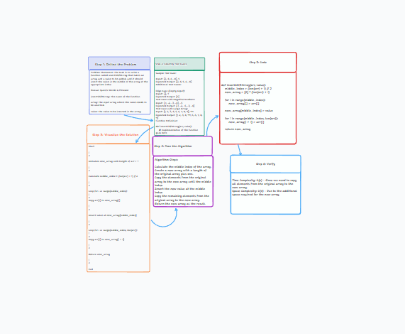

# Challenge Title

Insert and Shift an Array in the Middle at Index

## Whiteboard Process



## Approach & Efficiency

To insert an element in the middle of an array, we'll first calculate the middle index of the array. We can use the formula `(length of array + 1) / 2` to find the middle index. Then, we'll create a new array with the length of the original array plus one. We'll iterate through the original array and copy elements to the new array until we reach the middle index. At the middle index, we'll insert the new value. Then, we'll continue copying the remaining elements from the original array to the new array. This will effectively insert the value at the middle index.

The time complexity of this approach is O(n) since we need to copy all the elements from the original array to the new array.

## Solution

```python
def insertShiftArray(arr, value):
    middle_index = (len(arr) + 1) // 2
    new_array = [0] * (len(arr) + 1)

    for i in range(middle_index):
        new_array[i] = arr[i]

    new_array[middle_index] = value

    for i in range(middle_index, len(arr)):
        new_array[i + 1] = arr[i]

    return new_array
```

Example:

```python
arr1 = [2, 4, 6, -8]
value1 = 5
result1 = insertShiftArray(arr1, value1)
print(result1)  # Output: [2, 4, 5, 6, -8]

arr2 = [42, 8, 15, 23, 42]
value2 = 16
result2 = insertShiftArray(arr2, value2)
print(result2)  # Output: [42, 8, 15, 16, 23, 42]
```

[code link](https://github.com/LatherioK0818/data-structures-and-algorithms/pull/18)
