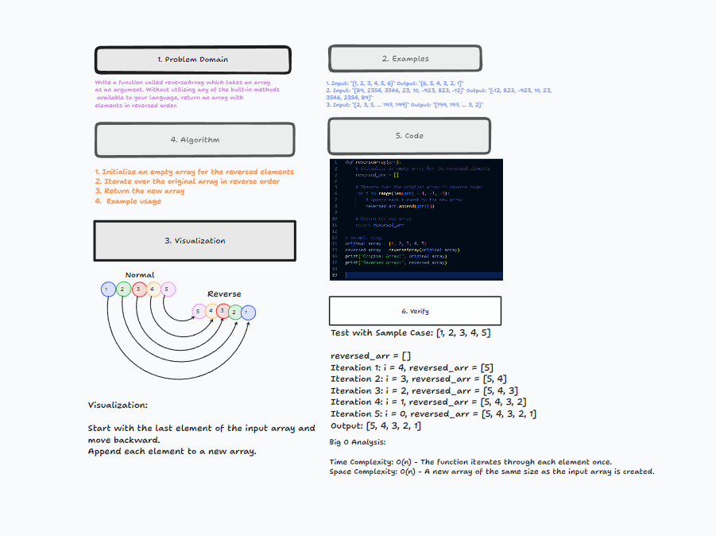

# Challenge Title: Reverse an Array

## Code Challenge

This challenge involves writing a function to reverse an array without utilizing built-in methods.

### Specifications

- **Repository Name**: `data-structures-and-algorithms`
- **Branch Name**: `array-reverse`
- **Directory Name**: Follow your language’s naming conventions, containing a `README.md` file.
- **Table of Contents**: Update the main `README.md` with a link to this challenge’s `README.md`.
- **Whiteboard Process**: Focus on the whiteboard process. Code implementation is optional.

### Feature Tasks

Develop a function `reverseArray` that:

- Takes an array as an argument.
- Returns an array with elements in reversed order.
- Does not use built-in methods for reversing.

### Examples

1. Input: `[1, 2, 3, 4, 5, 6]` Output: `[6, 5, 4, 3, 2, 1]`
2. Input: `[89, 2354, 3546, 23, 10, -923, 823, -12]` Output: `[-12, 823, -923, 10, 23, 3546, 2354, 89]`
3. Input: `[2, 3, 5, ... 197, 199]` Output: `[199, 197, ... 3, 2]`

### Structure and Testing

- Adhere to the Single-responsibility principle.
- Write clean, reusable, abstract component parts.

### Stretch Goal

- Implement a different methodology to solve the problem (e.g., recursion, loops).
- Compare different approaches for efficiency, readability, etc.

### Submission Instructions

- Work within the proper folder structure.
- Create a new README using the README TEMPLATE provided.
- Include:
  - Whiteboard image.
  - Link to code (if implemented).
- Test your algorithm on a chatbot (optional).
- Create a pull request from your branch to the main branch.
- In your pull request, include the following checklist:
  - [ ] Top-level README “Table of Contents” updated
  - [ ] Challenge README complete
  - [ ] Feature tasks completed
  - [ ] Unit tests written and passing
- Submit the link to your pull request.

### Grading Rubric
Points are awarded based on:
- Effort (0-2 points)
- Working Solution (0-2 points)
- Process and Documentation (0-1 points)

## Whiteboard Process


## Approach & Efficiency

The chosen approach was to create a new array and fill it with the elements of the input array in reverse order. This method was selected because it is straightforward, easy to understand and implement, and does not modify the original array, preserving its state. The steps involved in this approach are:

1. **Initialization of a New Array:** A new array, `reversed_arr`, is created to store the reversed elements. This ensures that the original array remains unchanged.
2. **Iterative Reversal:** The input array `arr` is iterated from the last element to the first. This reverse iteration is key to the approach, as it allows elements to be accessed in reverse order without needing additional operations.
3. **Appending Elements:** During each iteration, the current element is appended to `reversed_arr`. This step builds the reversed array incrementally.
4. **Return the Reversed Array:** Once all elements have been appended in reverse order, `reversed_arr` is returned.

This approach is chosen for its simplicity and clarity, which are often advantageous in programming, especially when readability and maintainability of the code are important.

### Big O Efficiency:

- **Time Complexity: O(n)**
  - The time complexity is linear, O(n), where `n` is the number of elements in the input array. This is because the function performs a single loop over the array, and each element is processed exactly once. The time taken by the function scales linearly with the size of the input.

- **Space Complexity: O(n)**
  - The space complexity is also linear, O(n), due to the creation of a new array, `reversed_arr`, which stores the reversed elements. The size of this new array is directly proportional to the size of the input array. Therefore, the amount of additional memory used by the function scales linearly with the input size.

This approach is efficient in terms of time as it minimizes the number of operations needed to reverse the array. The trade-off is the additional space required for the new array, but this is often an acceptable compromise in many programming contexts where modifying the original data is not desired.


## Solution

Here's how you can run the `reverseArray` function with examples to see it in action:
[Reverse-Array](/reverse.py)

### Running the Code:

You can run this function in any Python environment. Here's the function definition again for reference:

```python
def reverseArray(arr):
    reversed_arr = []
    for i in range(len(arr) - 1, -1, -1):
        reversed_arr.append(arr[i])
    return reversed_arr
```

### Examples:

1. **Standard Test Case:**

   ```python
   original_array = [1, 2, 3, 4, 5]
   reversed_array = reverseArray(original_array)
   print("Original Array:", original_array)
   print("Reversed Array:", reversed_array)
   ```

   **Expected Output:**

   ```
   Original Array: [1, 2, 3, 4, 5]
   Reversed Array: [5, 4, 3, 2, 1]
   ```

2. **Empty Array Test Case:**

   ```python
   original_array = []
   reversed_array = reverseArray(original_array)
   print("Original Array:", original_array)
   print("Reversed Array:", reversed_array)
   ```

   **Expected Output:**

   ```
   Original Array: []
   Reversed Array: []
   ```

3. **Single Element Array Test Case:**

   ```python
   original_array = [42]
   reversed_array = reverseArray(original_array)
   print("Original Array:", original_array)
   print("Reversed Array:", reversed_array)
   ```

   **Expected Output:**

   ```
   Original Array: [42]
   Reversed Array: [42]
   ```

These examples demonstrate the function handling various cases: a standard array, an empty array, and an array with a single element. You can run these examples in a Python interpreter or script to verify the function's behavior.
