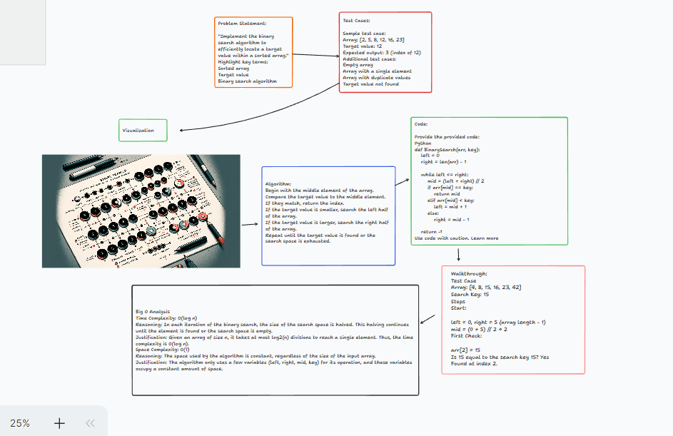

# Challenge Title

**Binary Search Implementation**

## Description of the challenge

In this challenge, you are required to implement the binary search algorithm in your preferred programming language. Binary search is an efficient algorithm for finding an item from a sorted list of items. It works by repeatedly dividing in half the portion of the list that could contain the item, until the possible locations are reduced to just one.

### ## Whiteboard Process



#### ## Approach & Efficiency

**Approach:** The approach taken is the standard binary search algorithm. It starts by comparing the middle item of the array with the search key. If a match is found, the index of the item is returned. If the search key is greater than the middle item, the algorithm repeats on the sub-array to the right of the middle item. Otherwise, it repeats on the sub-array to the left.

**Efficiency:**

- **Time Complexity:** The time complexity is O(log n), where n is the number of elements in the array. This is because the algorithm divides the search interval in half with each step.
- **Space Complexity:** The space complexity is O(1), as the binary search is implemented iteratively and only a few variables are used, which take up constant space.

#### ## Solution
**Running the Code:** To use the BinarySearch function, simply call it with a sorted array and the search key as arguments. For example:
```python
index = BinarySearch([1, 3, 5, 7, 9], 5)
print(index)  # Output: 2
```

**Examples:**
1. `BinarySearch([4, 8, 15, 16, 23, 42], 15)` returns `2`.
2. `BinarySearch([-131, -82, 0, 27, 42, 68, 179], 42)` returns `4`.
3. `BinarySearch([11, 22, 33, 44, 55, 66, 77], 90)` returns `-1`.
4. `BinarySearch([1, 2, 3, 5, 6, 7], 4)` returns `-1`.


