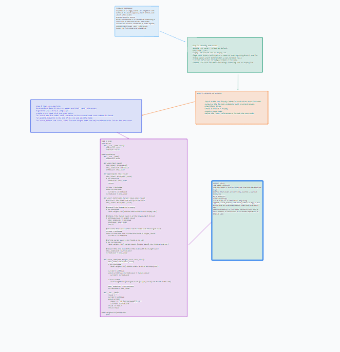

# Challenge Title: Extend a Linked List with Insertion Methods

## Whiteboard Process

## Approach & Efficiency

In this challenge, I extended the functionality of a Linked List by implementing three methods: `append`, `insert before`, and `insert after`. These methods enhance the versatility of the Linked List in handling data insertion in various ways.

- **`append` Method**: This method adds a new node to the end of the list. Its time complexity is O(n), where n is the length of the list, as it needs to traverse the entire list to find the end. The space complexity is O(1), as it only creates one new node regardless of the list size.

- **`insert before` Method**: This method inserts a new node before a specified node. Its time complexity is O(n) for traversing the list to find the right position. Space complexity is O(1) as it creates a single new node.

- **`insert after` Method**: This method adds a new node immediately after a specified node. The time complexity is O(n) in the worst case if the node is at the end of the list. Space complexity remains O(1).

## Solution

### How to Run the Code

- Clone the repository: `git clone [repository URL]`.
- Switch to the branch: `git checkout linked-list-insertions`.
- Compile the code (if using a compiled language).
- Run the tests to verify the implementation.

### Examples in Action

#### Append

- Initial List: `head -> {1} -> {3} -> {2} -> X`
- Method Args: `5`
- Resulting List: `head -> {1} -> {3} -> {2} -> {5} -> X`

#### Insert Before

- Initial List: `head -> {1} -> {3} -> {2} -> X`
- Method Args: `3, 5`
- Resulting List: `head -> {1} -> {5} -> {3} -> {2} -> X`

#### Insert After

- Initial List: `head -> {1} -> {3} -> {2} -> X`
- Method Args: `3, 5`
- Resulting List: `head -> {1} -> {3} -> {5} -> {2} -> X`

### Unit Tests

- Test appending nodes to an empty and non-empty list.
- Test inserting before various positions (including edge cases).
- Test inserting after various positions (including edge cases).
- Ensure exceptions are handled correctly for invalid operations.

### Stretch Goal

Implement a `delete` method that removes a node with a specified value from the list.

## Submission Instructions

- Ensure all files are pushed to the `linked-list-insertions` branch.
- Create a detailed README with all sections filled out.
- Complete and embed the whiteboard image.
- Ensure all unit tests are written and passing.
- Create a pull request and fill out the checklist provided.

### Grading Rubric
Effort, working solution, and documentation/process are the key factors in grading. Make sure to follow the best coding practices and write a comprehensive documentation.

---

This template covers all the key aspects of the challenge, including approach, efficiency, solution, and testing. Remember to replace placeholders with actual data like repository URLs or specific implementation details.
