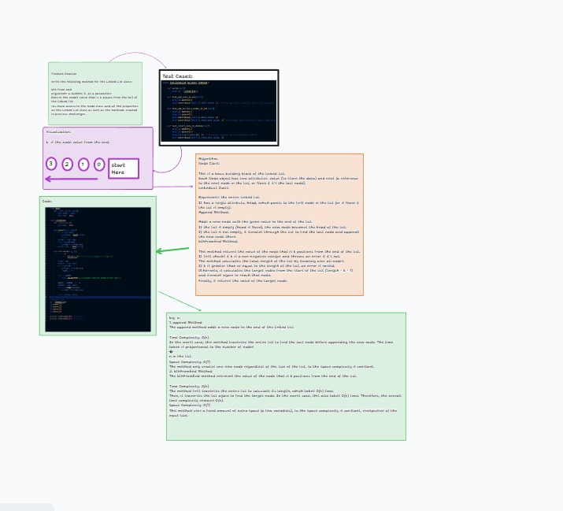

# Challenge Title: Find k-th Value from End of a Linked List

## Challenge Description

This challenge involves extending the functionality of a singly linked list to include a method that returns the value of the node located k positions from the end of the list. This method is critical in scenarios where the length of the list is unknown or the list is too long, and we need to access elements from the end efficiently.

## Whiteboard Process



## Approach & Efficiency

The approach taken involves two main steps:

1. Traverse the entire list to determine its length.
2. Calculate the target position from the start of the list (length - k) and traverse again to reach that node.

This approach is straightforward and ensures that we can find the k-th element from the end without needing to modify the linked list structure.

- **Time Complexity**: O(n), where n is the number of nodes in the linked list. This is because, in the worst case, we might need to traverse the entire list twice.
- **Space Complexity**: O(1), as the space used does not depend on the size of the input list but only on a few temporary variables.

## Solution

## How to Run the Code

1. Clone the repository containing the LinkedList class.
2. Use the method `kthFromEnd(k)` on your linked list instance.

### Examples in Action

```python
ll = LinkedList()
ll.append(1)
ll.append(3)
ll.append(8)
ll.append(2)

# Example 1: Get the last element
print(ll.kthFromEnd(0))  # Output should be 2

# Example 2: Get the third-to-last element
print(ll.kthFromEnd(2))  # Output should be 3
```
