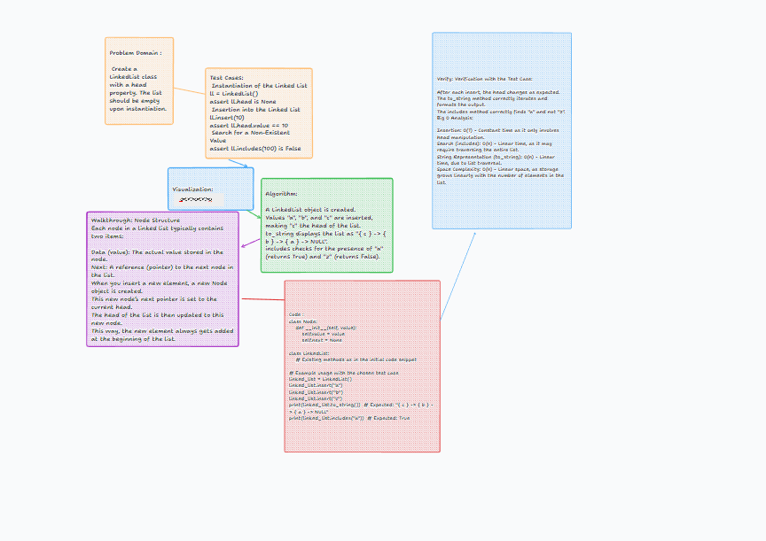

# Challenge Title

Singly Linked List Implementation

## Description of the Challenge

The challenge was to implement a Singly Linked List in Python. In a singly linked list, each node points to the next node in the list, forming a sequential chain. This implementation includes functionalities such as inserting new nodes at the beginning of the list, checking for the existence of a value within the list, and converting the entire list into a string representation.

## Whiteboard Process



## Approach & Efficiency

### Approach

The implementation involves two classes:

- **Node**: Represents each element in the list with a `value` and a reference to the `next` node.
- **LinkedList**: Manages the list, with methods for insertion (`insert`), searching (`includes`), and representation (`to_string`).

### Efficiency

- **Time Complexity**:
  - Insertion (`insert`): O(1), as it only involves adjusting the `head` of the list.
  - Search (`includes`): O(n), since in the worst case, it needs to traverse the entire list.
  - String Representation (`to_string`): O(n), as it requires traversing all nodes to format their values.

### Big O Notation

- **Space Complexity**: O(n) for storing n nodes in the list.
- **Time Complexity**: As mentioned above, it varies based on the operation.

## Solution

To use the singly linked list, first instantiate the LinkedList class and then use its methods. Here's an example of how it works:

```python
linked_list = LinkedList()
linked_list.insert("a")
linked_list.insert("b")
linked_list.insert("c")

print(linked_list.to_string())  # Output: "{ c } -> { b } -> { a } -> NULL"
print(linked_list.includes("a"))  # Output: True
print(linked_list.includes("z"))  # Output: False
```

This shows the insertion of elements, checking for an element's existence, and the string representation of the list.
