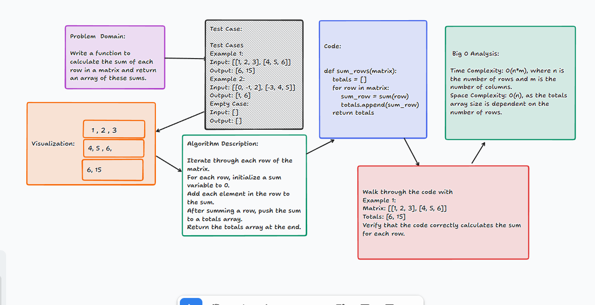

# Sum Rows of a Matrix Challenge

## Description of the Challenge

The challenge is to write a Python function named `sum_rows` that takes a matrix (a list of lists) as input. The function should calculate the sum of each row in the matrix and return a list of these sums.

## Whiteboard Process



## Approach & Efficiency

- **Approach:** The solution iterates through each row of the matrix. For each row, it uses Python's built-in `sum()` function to calculate the sum of the row and appends this sum to a totals list. This process is repeated for each row in the matrix.

- **Time Complexity:** O(n*m), where n is the number of rows and m is the number of columns in the matrix. This complexity arises from iterating through each element in the matrix.
- **Space Complexity:** O(n), where n is the number of rows. This space is used to store the sum of each row in the totals list.

## Solution

### Running the Code

To run the `sum_rows` function, use the following Python code:

```python
def sum_rows(matrix):
    totals = []
    for row in matrix:
        sum_row = sum(row)
        totals.append(sum_row)
    return totals

# Example Usage
print(sum_rows([[1, 2, 3], [4, 5, 6]]))  # Outputs: [6, 15]
print(sum_rows([[0, -1, 2], [-3, 4, 5]])) # Outputs: [1, 6]
print(sum_rows([]))                       # Outputs: []
```

### Examples in Action

- **Example 1:**
  - Input: `[[1, 2, 3], [4, 5, 6]]`
  - Output: `[6, 15]`
- **Example 2:**
  - Input: `[[0, -1, 2], [-3, 4, 5]]`
  - Output: `[1, 6]`

- **Empty Case:**

  - Input: `[]`
  - Output: `[]`
