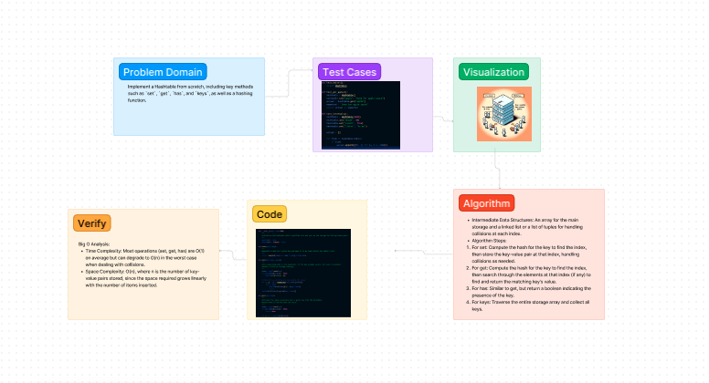

# Challenge Title: Implementing a Hashtable

## Challenge Description

This challenge involves implementing a Hashtable from scratch, including key methods such as `set`, `get`, `has`, and `keys`, as well as a hashing function. The goal is to understand the underlying mechanics of hashtables, including handling collisions and calculating hash values.

## Whiteboard Process



## Approach & Efficiency

The approach taken involves using an array to store values indexed by a hash function. The hash function converts keys to indices in the array, where the values are stored. In case of hash collisions, a nested structure (list of tuples) is used to store multiple key-value pairs at the same index.

### Big O Notation

- **Time Complexity**:
  - `set`: O(1) on average, O(n) in the worst case of a collision.
  - `get`: O(1) on average, O(n) in the worst case of a collision.
  - `has`: O(1) on average, O(n) in the worst case of a collision.
  - `keys`: O(n) as it requires traversing all entries.

- **Space Complexity**: O(n), where n is the number of key-value pairs stored. This is because the storage grows linearly with the number of items stored.

## Solution

To run the code, ensure you have a Python environment setup and execute the script containing the `Hashtable` class definition. Example usage is as follows:

```python
from data_structures.hashtable import Hashtable

# Create a new hashtable instance
ht = Hashtable()

# Set key-value pairs
ht.set("key1", "value1")
ht.set("key2", "value2")

# Get a value by key
print(ht.get("key1"))  # Output: value1

# Check if a key exists
print(ht.has("key3"))  # Output: False

# List all keys
print(ht.keys())  # Output: ['key1', 'key2']
```

Replace the example code with actual usage examples that are relevant to your implementation.

### Running Tests

To run tests, use the following command:

```bash
pytest tests/data_structures/test_hashtable.py
```

Ensure you have `pytest` installed in your environment and that the test file path matches your project structure.
```

