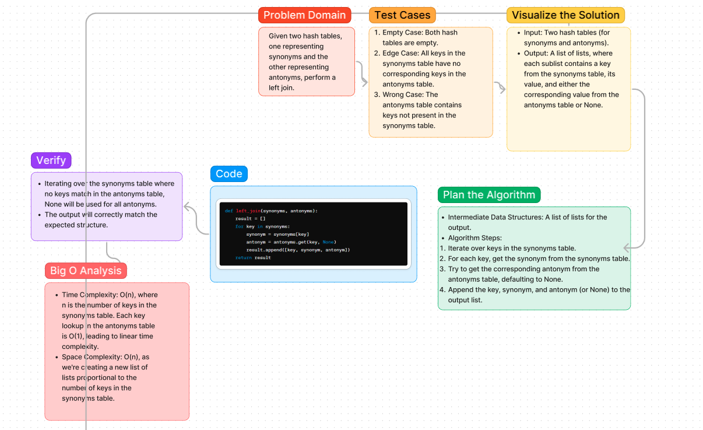

# Challenge Title: Synonyms and Antonyms Left Join

## Description of the challenge

In this challenge, you are tasked with implementing a function that performs a "left join" operation on two hash tables (dictionaries in Python). The first hash table contains word synonyms, and the second contains word antonyms. The goal is to combine these tables based on their keys (words) such that for each key in the first table, you append its synonym and its corresponding antonym from the second table. If a key in the first table does not have a corresponding antonym in the second table, you should append `None` to indicate the absence of an antonym.

## Whiteboard Process




## Code

[Code](python\code_challenges\hashtable_left_join.py)

## Approach & Efficiency

The approach taken involves iterating through each key-value pair in the synonyms hash table, fetching the corresponding value from the antonyms hash table (if it exists), and then constructing a list that contains the key, its synonym, and its antonym or `None` if the antonym does not exist. This method ensures that all keys in the synonyms table are considered, and their related data from both tables are combined appropriately.

### Why this approach?

This approach is straightforward and ensures that each key in the synonyms table is addressed. It uses direct lookups in the antonyms table, which is efficient, and builds the result list in a single pass through the synonyms table.

### Big O space/time for this approach

- **Time Complexity**: O(N) - The function iterates once through all keys in the synonyms table. Assuming that hash table lookups occur in constant time, the overall time complexity is linear in the number of entries in the synonyms table.
- **Space Complexity**: O(N) - The space complexity is also linear in the size of the input, as a new list of size N (where N is the number of keys in the synonyms table) is created to store the results.

## Solution

### How to run the code:

```python
def left_join(synonyms, antonyms):
    results = []
    for key in synonyms.keys():
        synonym = synonyms[key]
        antonym = antonyms.get(key, None)
        results.append([key, synonym, antonym])
    return results

# Example usage
synonyms = {"diligent": "employed", "fond": "enamored", "guide": "usher"}
antonyms = {"diligent": "idle", "fond": "averse", "guide": "follow"}

result = left_join(synonyms, antonyms)
print(result)
```

### Examples of it in action:

Input:

```python
synonyms = {
    "diligent": "employed",
    "fond": "enamored",
    "guide": "usher",
    "outfit": "garb",
    "wrath": "anger",
}
antonyms = {
    "diligent": "idle",
    "fond": "averse",
    "guide": "follow",
    "flow": "jam",
    "wrath": "delight",
}
```

Output:

```python
[
   ["diligent", "employed", "idle"],
   ["fond", "enamored", "averse"],
   ["guide", "usher", "follow"],
   ["outfit", "garb", None],
   ["wrath", "anger", "delight"]
]
```

This solution effectively demonstrates the left join operation on two dictionaries, handling cases where an antonym might not exist for a given synonym.
