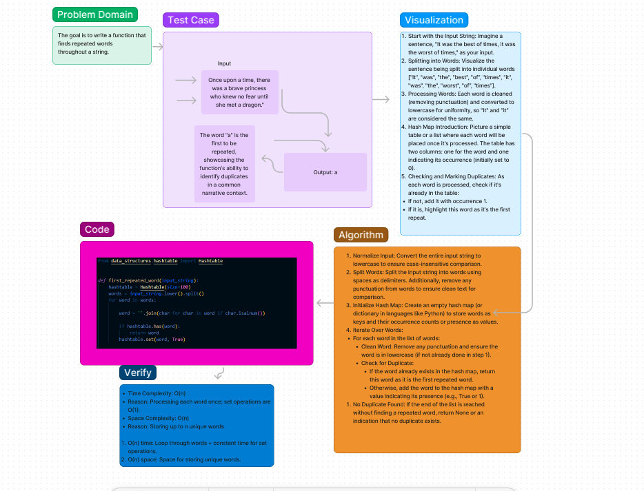

# First Repeated Word Challenge

## Challenge Summary

This challenge involves writing a function that finds the first word to occur more than once in a string. The function, `first_repeated_word`, takes a string as an argument and returns the first repeated word it finds. If no word is repeated, it returns `None`.

## Whiteboard Process



)

## Approach & Efficiency

The approach taken involves using a hash table to efficiently track the occurrence of words. As we iterate through the words in the input string, we clean each word of punctuation, convert it to lowercase to ensure case-insensitive comparison, and then check if the word is already present in the hash table. If a word is found in the hash table, it means it has occurred before, and we return it as the first repeated word. Otherwise, we add the word to the hash table and continue the process.

- **Time Complexity**: O(n), where n is the number of words in the input string. This is because we process each word exactly once.
- **Space Complexity**: O(n), as in the worst case, we might end up storing every word in the hash table if there are no repetitions.

## Requirements

- Python 3.x
- `data_structures` package (Ensure the `Hashtable` class is correctly implemented and accessible)

## Setup & Execution

1. Ensure that the `data_structures` package is correctly set up in your Python environment and that the `Hashtable` class is implemented and working.
2. Save the `first_repeated_word` function in a Python file.
3. Run the file using Python.

## Example

```python
input_string = "It was the best of times, it was the worst of times, ..."
print(first_repeated_word(input_string))
# Output: "it"
