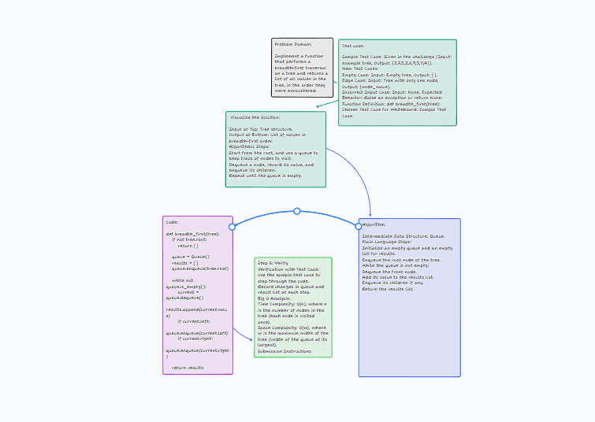

# Challenge Title
Breadth-first Traversal

## Whiteboard Process


## Approach & Efficiency

**Approach:**
- The approach taken is a breadth-first traversal of a tree. This involves traversing the tree level by level, starting from the root, and moving down to the leaves.
- A queue data structure is used to keep track of nodes to visit, ensuring that nodes are processed in the order they are encountered.

**Efficiency:**
- **Time Complexity:** O(n), where n is the number of nodes in the tree. This is because each node is visited exactly once.
- **Space Complexity:** O(w), where w is the maximum width of the tree. This represents the space needed for the queue, which holds a level of the tree at most.

## Solution

**How to Run the Code:**
```
python tree_breadth_first.py
```

**Code Example:**
```python

def breadth_first(tree):
    if not tree.root:
        return []

    queue = Queue()
    results = []
    queue.enqueue(tree.root)

    while not queue.is_empty():
        current = queue.dequeue()
        results.append(current.value)
        if current.left:
            queue.enqueue(current.left)
        if current.right:
            queue.enqueue(current.right)

    return results
```
