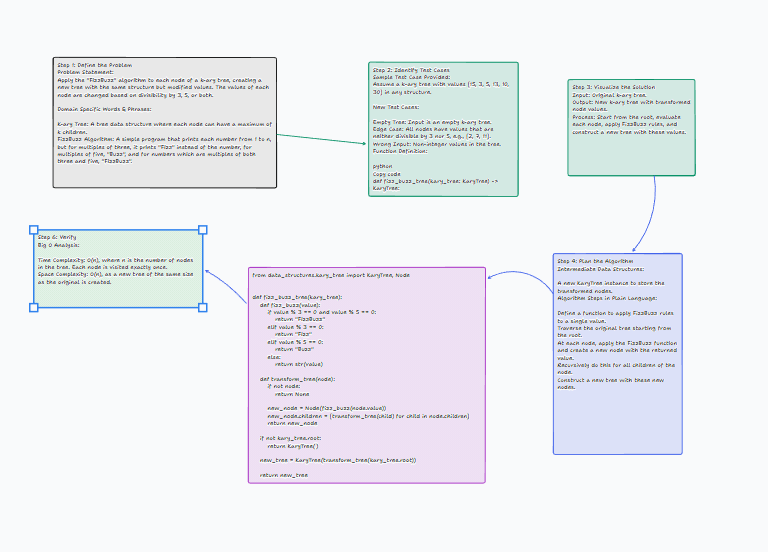

# Challenge Title: FizzBuzz on a K-ary Tree

## Challenge Description

The challenge is to apply the classic "FizzBuzz" problem to a k-ary tree. The objective is to traverse a k-ary tree, evaluate each node's value, and construct a new tree where each node's value is modified based on FizzBuzz rules: replace with "Fizz" if divisible by 3, "Buzz" if divisible by 5, "FizzBuzz" if divisible by both, or convert the value to a string if none apply.

## Whiteboard Process



## Approach & Efficiency

The approach involves a recursive function that traverses each node of the k-ary tree. For each node, the value is transformed based on the FizzBuzz criteria using the `fizz_buzz` helper function. This results in a new tree mirroring the structure of the original but with modified values. The time complexity of this approach is O(n), as each node is visited once, and the space complexity is also O(n) due to the creation of a new tree.

[Code](python\code_challenges\tree_fizz_buzz.py)

## Solution

The solution is implemented in Python and is encapsulated in the `fizz_buzz_tree` function. This function uses two nested helper functions: `fizz_buzz` for value transformation and `transform_tree` for recursive traversal and node creation. The function accepts a k-ary tree and returns a new k-ary tree with values transformed as per FizzBuzz rules.

### Example Usage:

```python
# Create an instance of KaryTree
original_tree = KaryTree(...)
# Apply FizzBuzz transformation
transformed_tree = fizz_buzz_tree(original_tree)
# The transformed_tree now contains the FizzBuzz modified values
```

### Collaborators

Ekow Yawson
Stephanie G. Johnson
