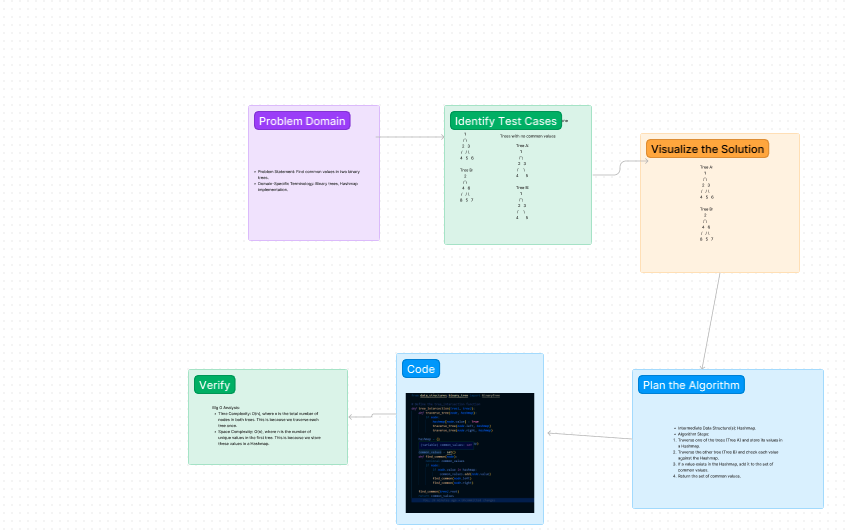

# Tree Intersection

## Description

In this challenge, the task is to find common values in two binary trees. The implementation should utilize a Hashmap to efficiently identify the common values.

## Whiteboard Process



## Approach & Efficiency

For the `tree_intersection` function, we utilize a Hashmap to store values from one binary tree and then traverse the other tree to find common values. This approach has a time complexity of O(n) where n is the total number of nodes in both trees. The space complexity is also O(n) due to the storage of values in the Hashmap.

## Solution

To run the code and see examples of it in action, follow these steps":

```
python tree_insertions.py
```

### Python

1. Navigate to the `tree_intersection` folder.
2. Open the `tree_intersection.py` file.
3. Implement the `tree_intersection` function.
4. Write test cases to ensure functionality.

